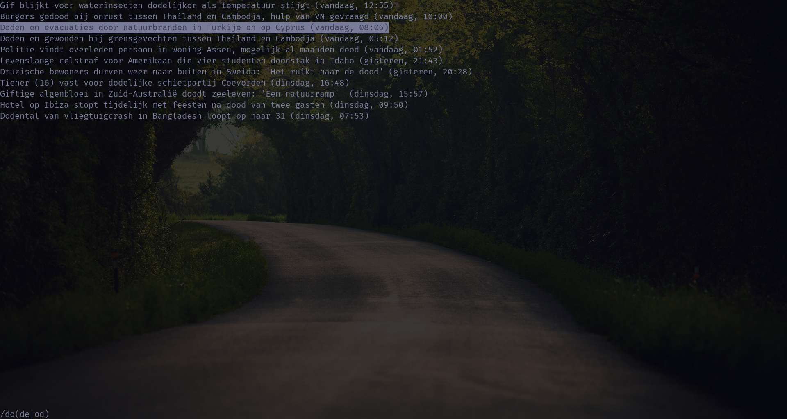

# nos-cli
[NOS News](https://nos.nl) on the command-line.


## Installation
```bash
cargo install --path .
```

## Usage
```
Usage: nos-cli [OPTIONS]

Options:
  -c, --category <CATEGORY>  News category to show articles for [default: laatste]
  -h, --help                 Print help
  -V, --version              Print version
```
List of valid categories: `laatste`, `binnenland`, `buitenland`, `regio`, `politiek`, `economie`, `koningshuis`, `cultuur-en-media`, `opmerkelijk`.

## Keybinds
The keybindings for `nos-cli` are inspired by [Vim keybindings](https://www.vim.org/).

| Keybinds             | Action           |
|----------------------|------------------|
| `<q>`\|`<Esc>`       | Exit `nos-cli`   |
| `<k>`\|`<ArrowUp>`   | Move up          |
| `<j>`\|`<ArrowDown>` | Move down        |
| `<g>`                | Go to the top    |
| `<G>`                | Go to the bottom |
| `<b>`                | Go back          |
| `<Enter>`\|`<i>`     | Enter an article |
| `</>`                | Search           |
| `<r>`                | Reset search     |
